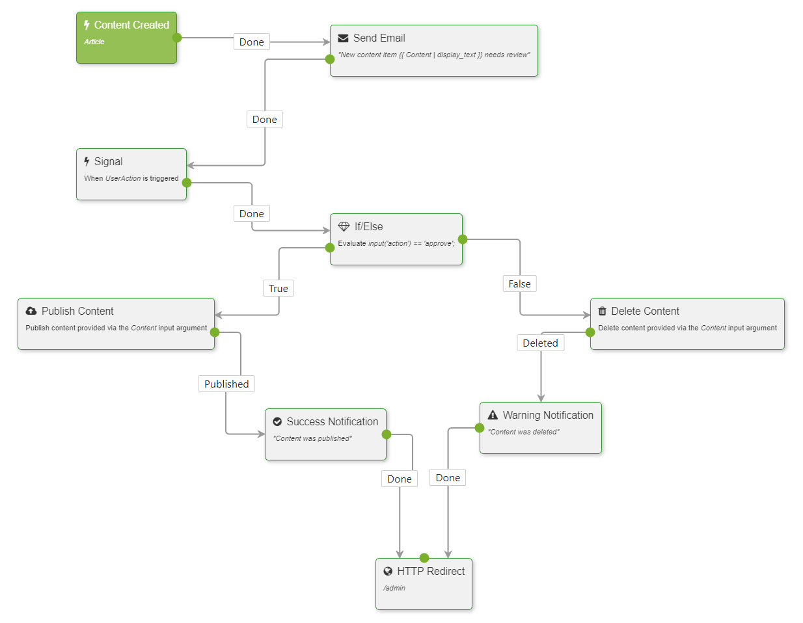
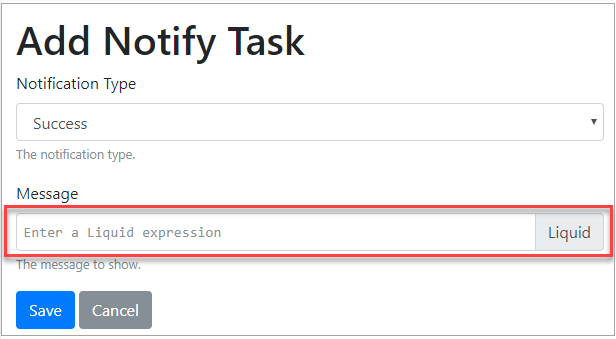

# Workflows (OrchardCore.Workflows)

The Workflows module provides a way for users to visually implement business rules using flowchart diagrams.

A simple use case scenario for a workflow is a _content approval_ workflow, where some administrative user received an email when a contributor creates a new article. The email can contain actions such as an _Approve_ and _Reject_ link. When one of these links are clicked, the workflow execution resumes and either approves or rejects the article in question.



A workflow and its activities are analogous to a C# function and its statements.

## Anatomy of a Workflow

A workflow is a essentially collection of activities that are connected to eachother. These connections are called transitions.
Activities and their transitions are stored in a **Workflow Definition**.

In order for a workflow to execute, at least one activity must be marked as the start of the workflow. The starting activity typically represents an **event**, for example _Content Created_.
Each activity has one or more **outcomes**, which represent a source endpoint from which a connection can be made to the next activity. This connection is called a transition.

By connecting activities, you are effectively creating a program that can be executed by Orchard in response to a multitude of events. 

## Workflow Execution

When a workflow executes, the **Workflow Manager** first creates a **Workflow Instance**. A workflow instance maintains state about the execution, such as which activity to execute next and state that can be provided by individual activities.

Workflows can be short-lived as well as long-lived (aka "long-running"). When a workflow executes without encountering any **blocking** activities (i.e. activities that wait for an event to occur, such as _Signal_), the workflow will run to completion and then go out of memory.

If, on the other hand, workflow execution _does_ encounter a blocking activity, the workflow manager will halt execution and **persist** the workflow instance.

When an event occurs on which a halted workflow instance is waiting, the workflow manager will load the workflow instance back into memory, and resume its execution.

## Anatomy of an Activity

An activity represents a single step in a workflow, and are implemented as regular .NET classes that ultimately implement the `IActivity` interface

Some activities implement `IEvent`, which is itself derived from `IActivity`. Event activities are typically added as the root activity to kick-off a workflow in response to an event that is represented by that activity event.

Most activity implementations derive either from `TaskActivity` or `EventActivity`, since not all activities need to care about all available methods.

The `IActivity` interface has the following members:

- Name
- Category
- Description
- Properties
- HasEditor
- GetPossibleOutcomes
- CanExecuteAsync
- ExecuteAsync
- ResumeAsync
- OnInputReceivedAsync
- OnWorkflowStartingAsync
- OnWorkflowStartedAsync
- OnWorkflowResumingAsync
- OnWorkflowResumedAsync
- OnActivityExecutingAsync
- OnActivityExecutedAsync

The `IEvent` interface adds the following member:

- CanStartWorkflow

The following is an example of a simple activity implementation that displays a notification:

```csharp
public class NotifyTask : TaskActivity
{
    private readonly INotifier _notifier;
    private readonly IStringLocalizer S;
    private readonly IHtmlLocalizer H;

    public NotifyTask(INotifier notifier, IStringLocalizer<NotifyTask> s, IHtmlLocalizer<NotifyTask> h)
    {
        _notifier = notifier;

        S = s;
        H = h;
    }

    // The technical name of the activity. Activities on a workflow definition reference this name.
    public override string Name => nameof(NotifyTask);

    // The category to which this activity belongs. The activity picker groups activities by this category.
    public override LocalizedString Category => S["UI"];

	// A description of this activity's purpose. 
    public override LocalizedString Description => S["Display a message."];

    // The notification type to display.
    public NotifyType NotificationType
    {
        get => GetProperty<NotifyType>();
        set => SetProperty(value);
    }

	// The message to display.
    public WorkflowExpression<string> Message
    {
        get => GetProperty(() => new WorkflowExpression<string>());
        set => SetProperty(value);
    }

    // Returns the possible outcomes of this activity.
    public override IEnumerable<Outcome> GetPossibleOutcomes(WorkflowContext workflowContext, ActivityContext activityContext)
    {
        return Outcomes(S["Done"]);
    }

    // This is the heart of the activity and actually performs the work to be done.
    public override async Task<ActivityExecutionResult> ExecuteAsync(WorkflowContext workflowContext, ActivityContext activityContext)
    {
        var message = await workflowContext.EvaluateExpressionAsync(Message);
        _notifier.Add(NotificationType, H[message]);
        return Outcomes("Done");
    }
}
```

## Script & Liquid syntax

When working with certain activities, you will notice that certain fields of an activity has support for **Script** or **Liquid** syntax.

For example, when adding the **Notify** activity, its editor shows the folling fields:



These type of fields allow you to enter Liquid markup, enabling access to system-wide variables and filters as well as variables from the **workflow execution context**.

## Creating Custom Workflow Activities  

Orchard is built to be extended, and the Workflows module is no different. When creating your own module, you can develop custom workflow activities. Developing custom activities typically involve the following:

1. Create a new class that directly or indirectly implements `IActivity`. In most cases, you either derive from `TaskActivity` or `EventActivity`, depending on whether your activity represents an event or not. Although not required, it is recommended to keep this class in a folder called **Activities**.
2. Create a new **display driver** class that directly or indirectly implements `IDisplayDriver`. The purpose of an activity display driver is three-fold: to control the activity's display on the **workflow editor canvas**, in the **activity picker** and in the **activity editor**. Although not required, it is recommended to keep this class in a folder called **Drivers**. 
3. Optionally implement a **view model** if your activity has properties that the user should be able to configure.
4. Implement the various Razor views for the various shapes provided by the driver. Although not required, it is recommended to store these files in the **Views/Items** folder. Note that it is required for your views to be discoverable by the display engine.  

## CREDITS

### jsPlumb
<https://github.com/jsplumb/jsplumb>
Copyright (c) 2010 - 2014 jsPlumb, http://jsplumbtoolkit.com/
License: dual-licensed under both MIT and GPLv
